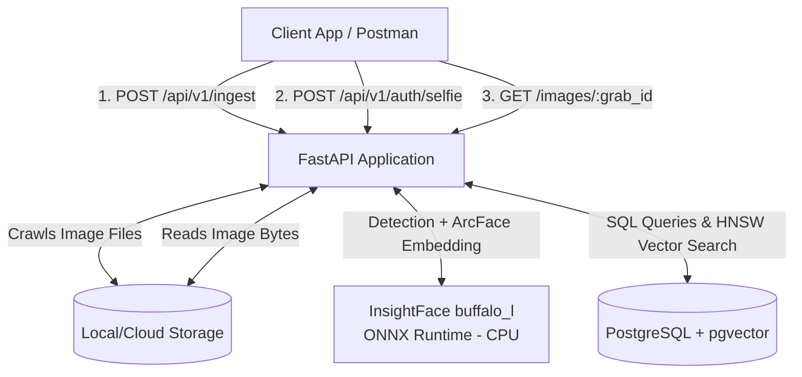
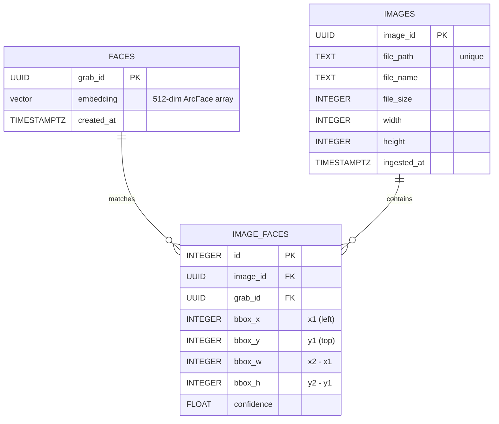

# Grabpic — Software Design Document (SDD)

## 1. Introduction

### 1.1 Purpose
This Software Design Document (SDD) details the architecture, components, database schemas, and logic flows for the **Grabpic Backend Engine**. It serves as a comprehensive reference for developers, engineers, and stakeholders to understand the underlying mechanisms of the intelligent image processing and facial retrieval system.

### 1.2 Scope
Grabpic is a high-performance backend solution built to handle large-scale event photography. Its core functionality revolves around two pipelines:
1. **Ingestion Pipeline**: Crawling storage directories, extracting metadata, detecting and encoding human faces using InsightFace, and storing mapping data.
2. **Retrieval Pipeline**: Authenticating a user via a "Selfie" upload, encoding the face, matching it against the database using vector cosine similarity, and returning all photos containing the user.

## 2. System Architecture

### 2.1 Architectural Overview

Grabpic adheres to a modular, monolithic architecture built upon **FastAPI**. It leverages a high-performance relational database (PostgreSQL) paired with the **pgvector** extension to natively handle vector similarity searches.

### 2.2 Core Components

1. **API Layer (`app/routes`)**: Exposes RESTful JSON endpoints.
2. **Service Layer (`app/services`)**: Business logic orchestration.
   - `face_service.py`: Interfaces with **InsightFace** (ONNX Runtime backend). Responsible for face detection and producing **512-dimensional ArcFace embeddings**. The model (`buffalo_l` by default) is lazy-loaded and cached via `functools.lru_cache` for efficient reuse across requests.
   - `ingestion_service.py`: Crawls standard image directories recursively and processes imagery into the database.
3. **Data Access & Storage (`app/database.py`, PostgreSQL)**: Utilises a `psycopg2` connection pool to communicate with the PostgreSQL instance. Stores relational data and performs HNSW index-accelerated vector searches.

### 2.3 Face Recognition Model

| Property | Value |
|---|---|
| Library | InsightFace |
| Model pack | `buffalo_l` (configurable via `FACE_MODEL` env var) |
| Embedding dimensions | **512-d float32** (ArcFace) |
| Inference backend | ONNX Runtime (CPU by default; GPU via `ctx_id=0`) |
| Bounding box format | `[x1, y1, x2, y2]` (top-left → bottom-right, pixel coords) |
| Model download | Auto on first run to `~/.insightface/models/<name>/` |

## 3. Data Model

### 3.1 Entity Relationship

### 3.2 Key Decisions
- **`embedding` column format**: `faces.embedding` is stored as `vector(512)`. The 512-d dimension matches the output of InsightFace's ArcFace model (`buffalo_l`).
- **HNSW Index**: An HNSW (Hierarchical Navigable Small World) index with `vector_cosine_ops` is deployed on the `embedding` column to make cosine KNN searches highly performant over massive datasets.
- **Bounding box storage**: The `image_faces` table stores `(bbox_x, bbox_y, bbox_w, bbox_h)` derived from InsightFace's `(x1, y1, x2, y2)` output as `(x1, y1, x2-x1, y2-y1)`.

### 3.3 Schema Migrations

| File | Change |
|---|---|
| `001_init.sql` | Creates all tables, enables pgvector, creates HNSW index (`vector(128)` — legacy) |
| `002_resize_embedding.sql` | Drops old HNSW index, resizes column `vector(128)` → `vector(512)`, recreates index |

> **Note:** After applying `002_resize_embedding.sql`, all previously ingested faces must be re-ingested because 128-d dlib embeddings are incompatible with 512-d InsightFace embeddings.

## 4. Pipeline Details

### 4.1 Ingestion Pipeline
Initiated by `POST /api/v1/ingest`.

1. **Crawl**: Recursively finds all image file extensions (`.jpg`, `.png`, `.jpeg`, `.webp`, `.bmp`) in the root `IMAGE_STORAGE_PATH`.
2. **Deduplication**: Checks `images.file_path` in PostgreSQL to ensure the image hasn't already been processed.
3. **Extraction**: Opens the image via Pillow. Gathers metadata (`size`, `width`, `height`); inserts row into `images` table.
4. **Face Detection**: Image converted to BGR NumPy array and passed to `FaceAnalysis.get()`. InsightFace returns bounding boxes and embeddings for every detected face.
5. **Facial Embedding & Matching**:
    - For each detected face, compare the 512-d ArcFace embedding against all rows in `faces` using cosine similarity.
    - If cosine similarity > `FACE_MATCH_TOLERANCE`, retrieve the existing `grab_id`.
    - If no match found, insert a new row into `faces` to generate a fresh `grab_id`.
6. **Relation Binding**: Insert a row into `image_faces` mapping `image_id` ↔ `grab_id` with bounding box data.

### 4.2 Selfie Authentication Pipeline
Initiated by `POST /api/v1/auth/selfie`.

1. **Ingest Bytes**: Receives a single form-data image upload.
2. **Memory Processing**: Converts bytes directly via Pillow → BGR NumPy — no filesystem staging required.
3. **Face Validation**: Enforces that at least one face exists. Returns HTTP 400 if the image is faceless.
4. **Similarity Search**: Queries the DB using `1 - (embedding <=> %s::vector)` to find the closest matching facial vector with similarity > threshold.
5. **Handshake**: Returns the matched `grab_id` and confidence score. This ID serves as a stateless authentication token to request images.

### 4.3 Retrieval Pipeline
Initiated by `GET /api/v1/images/{grab_id}`.

Serves paginated event images. Uses offset-based pagination, joining `images` through `image_faces` filtered by the provided `grab_id`. Returns image metadata and the bounding box of where the user appears in each photo.

## 5. Security & Performance Configurations

- **Similarity Threshold (`FACE_MATCH_TOLERANCE`)**: Defaults to `0.45` cosine similarity. Recommended range for InsightFace `buffalo_l`: `0.60`–`0.70` in production.
- **Transactions**: Atomic DB transactions wrap per-image inserts during ingestion to prevent orphaned records on failures.
- **Model Caching**: The InsightFace model is loaded once via `lru_cache` and reused for all subsequent requests, avoiding expensive ONNX model re-initialisation.
- **CPU vs GPU**: Default inference uses CPU (`ctx_id=-1`). For high-throughput production, change `ctx_id=0` in `face_service.py` and ensure CUDA ONNX Runtime is installed.
- **Database Scale**: pgvector's HNSW index scales efficiently up to millions of face vectors on modern hardware with standard PostgreSQL tuning.
